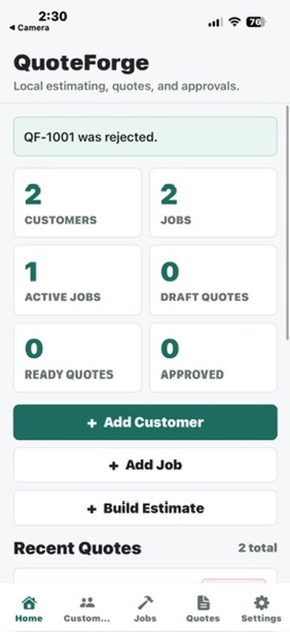
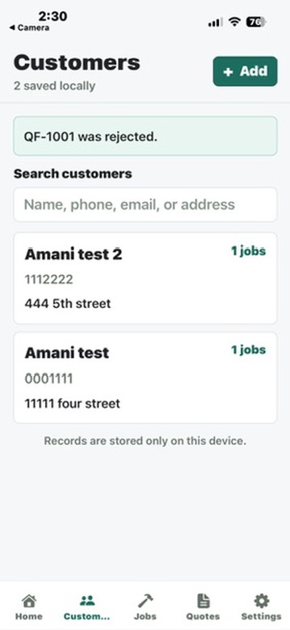
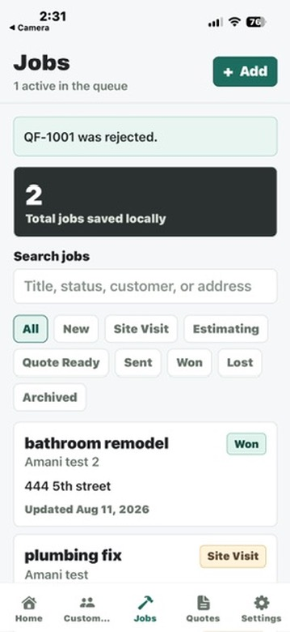
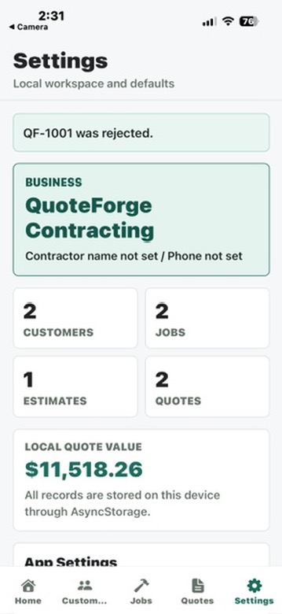
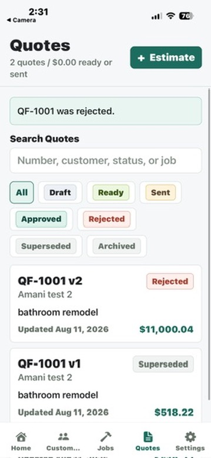

# QuoteForge Mobile

QuoteForge is a local-first contractor estimating app built with Expo + React Native + TypeScript and tested on a physical iPhone with Expo Go.

## Screenshots

### Home


### Customers


### Jobs


### Estimate Builder


### Quote Detail


## Stack

- Expo SDK 54
- React Native
- TypeScript
- Expo Router
- AsyncStorage local persistence
- Expo Print, Sharing, FileSystem, and Document Picker for local exports

## Run on iPhone

```bash
npm install
npx expo start --clear --host lan
```

Scan the QR code with the iPhone Camera app, then open it in Expo Go. Keep the iPhone and development machine on the same Wi-Fi network. If LAN discovery is blocked, use:

```bash
npx expo start --clear --host tunnel
```

## Current MVP Scope

- Home overview with local counts, recent quote activity, recent job queue, first-use empty state, and demo data action.
- Customer and job management with searchable lists, add/detail/edit screens, validation, local persistence, and protected delete.
- Job workflow with queue, status filters, status updates, validation, local persistence, and protected delete.
- Estimate builder with job selection, line items, reusable templates, labor/material/equipment/other item types, per-line markup, estimate markup, discount, tax, adjustments, notes, terms, save, duplicate, protected delete, and quote generation.
- Reusable labor and material templates with add, edit, duplicate, delete, and copy-to-estimate behavior.
- Quote snapshots with quote numbers, immutable customer/job/pricing/business snapshots, quote versions, status tracking, preview, PDF/share export, text fallback, typed local approval, rejection, and approval reset.
- Settings for business defaults, tax, markup, quote prefix/numbering, terms, reduced-motion preference, demo data, JSON backup/import, and clear local data.
- Versioned local snapshot persistence with migration from the original Task 1 snapshot shape.

## Local Data

Data is stored only on the device through AsyncStorage using a versioned snapshot:

```json
{
  "version": 2,
  "customers": [],
  "jobs": [],
  "estimates": [],
  "quotes": [],
  "laborTemplates": [],
  "materialTemplates": [],
  "approvals": [],
  "settings": {}
}
```

Export/import uses this JSON snapshot. Import is user-triggered and replaces the current local workspace only after confirmation. Demo data is also user-triggered and is appended, not automatically loaded.

## Verification Commands

```bash
npm install
npx expo-doctor
npm run typecheck
npm run lint
npm test
npm run check
npx expo start --clear --host lan
```

## Manual QA Checklist

- Launch the app in Expo Go from the QR code.
- Start with empty storage and confirm Home, Customers, Jobs, Quotes, and Settings empty states are clear.
- Add a customer with a valid name and optional email; confirm invalid email shows inline validation.
- Add a job and confirm customer selection is required.
- Open the job detail and build an estimate.
- Add a manual line item and verify totals update.
- Add labor and material templates in Settings, then copy them into an estimate.
- Save an estimate, duplicate it, and confirm both remain local.
- Create a quote from an estimate and confirm job status moves to Quote Ready.
- Preview the quote, share/export PDF, and use text share fallback if needed.
- Create a quote revision and confirm version history shows immutable snapshots.
- Type-approve a quote, then confirm the quote status changes to Approved and the job moves to Won.
- Export a JSON backup, import it back after confirmation, and verify records remain available.
- Clear local data only after exporting a backup if you need to preserve the workspace.

## Out of Scope

No backend, Supabase, authentication, cloud sync, payment processing, external API keys, custom development build, advanced signature capture, production customer data, or automated quoting intelligence is included yet.
